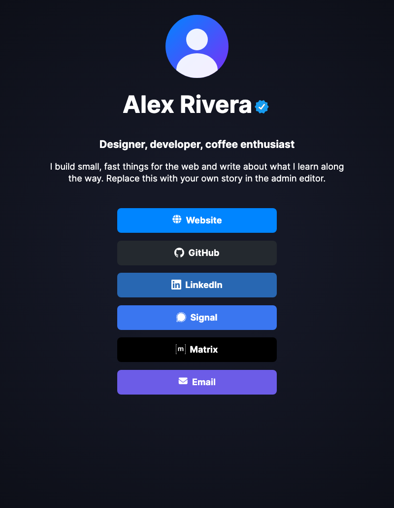
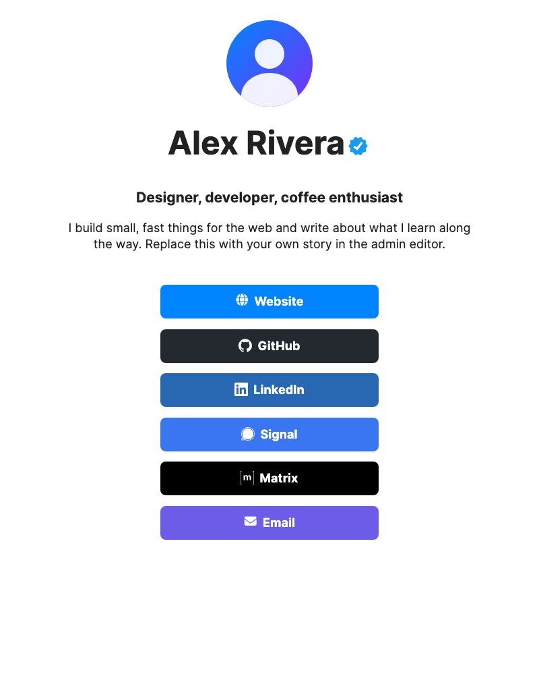

# profile-page

[](https://github.com/niels-emmer/profile-page/actions/workflows/ci.yml)
[](LICENSE)

**A link-in-bio page that's yours — not a SaaS account.** One small container, one
SQLite file, two runtime dependencies, and no build step. Self-host it behind your
reverse proxy, point your domain at it, and edit everything from a built-in admin
panel. It's a drop-in replacement for LinkStack and hosted link-in-bio services:
the same idea, a fraction of the footprint, and your data stays on your own disk.

<p align="center">
  
  
</p>

| | |
|---|---|
| **Image size** | ~170 MB on disk (~60 MB compressed) |
| **Runtime deps** | 2 (`hono`, `@hono/node-server`) |
| **Storage** | SQLite (`node:sqlite`) + local uploads |
| **Frontend** | Server-rendered HTML + one CSS file. No JS framework. |

## Features

- **Public profile page** at `/` — name, tagline, description, avatar, and a list
  of link buttons.
- **Built-in admin editor** at `/admin` — edit everything from the browser; no
  config files, no redeploys.
- **Custom favicon and per-theme backgrounds** — upload an image and it's resized
  and converted in your browser (512×512 PNG favicon, WebP backgrounds), with
  fill/fit/stretch, nine anchor points, tiling, scroll/fixed, and an image
  opacity over a solid background colour.
- **Drag to reorder** links, with Move up/down buttons for keyboard and no-JS use.
- **One-click backup & restore** — download the whole profile (content, theme, and
  images) as a `.tar.gz`, and restore it later.
- **Dark and light themes** — set a default of light, dark, or system (follow the
  visitor's OS), and optionally let visitors switch for themselves with a
  bottom-right switcher that remembers their choice.
- **Crawler- and agent-friendly** — `robots.txt`, `sitemap.xml`, `llms.txt`, a
  canonical link, `theme-color`, and schema.org `Person` JSON-LD.
- **Contact exchange** — a one-click vCard (`/contact.vcf`), a JSON summary
  (`/contact.json`), and a WebFinger probe (`/.well-known/webfinger`).
- **Tiny and dependency-light** — two runtime dependencies, no build step,
  TypeScript run directly by Node.
- **Hardened container** — non-root, read-only root filesystem, `cap_drop: ALL`,
  and no published ports.

## Quick start

### Docker (recommended)

```bash
git clone https://github.com/niels-emmer/profile-page.git
cd profile-page
cp .env.example .env
# set PROXY_NETWORK in .env to the Docker network your reverse proxy is on
docker compose up -d --build
```

The container joins the external Docker network named in `PROXY_NETWORK`
(default `proxy-net`) and listens on port `3000`; **no ports are published**.
Point your reverse proxy at `http://profile-page:3000`. If the network does not
exist yet, create it once: `docker network create <name>`.

Once it is running, open `/admin` on your domain to edit your profile — see
[Editing your profile](#editing-your-profile).

### Behind a reverse proxy

Any TLS-terminating proxy works (Nginx Proxy Manager, Caddy, Traefik). The proxy
and the container must share the Docker network named in `PROXY_NETWORK` in your
`.env`. For Nginx:

```nginx
server {
    listen 443 ssl;
    server_name example.com;

    location / {
        proxy_pass http://profile-page:3000;
        proxy_set_header Host $host;
        proxy_set_header X-Real-IP $remote_addr;
        # Overwrite, do not append, so the app sees a trustworthy client IP.
        proxy_set_header X-Forwarded-For $remote_addr;
        proxy_set_header X-Forwarded-Proto $scheme;
    }
}
```

Set `BASE_URL=https://example.com` in `.env` so absolute URLs (canonical,
`og:url`, sitemap, vCard) are correct.

### Local (no Docker)

```bash
npm install
npm run seed      # create the database and demo profile
npm start         # http://localhost:3000
```

Requires **Node.js >= 24** — the app runs TypeScript directly, with no build step.

## Editing your profile

Everything is edited from the built-in admin panel — no config files, no redeploys.

1. Open **`/admin`** on your site (e.g. `https://example.com/admin`, or
   `http://localhost:3000/admin` locally). You are redirected to `/login`.
2. Sign in. A fresh install starts with the bootstrap password **`changeme`**;
   the first visit to `/admin` then asks you to pick your own secure password.
3. Edit and save — changes appear on the public page immediately.

### Forgot your password?

Reset it from the container, then restart so the app picks it up (this also
signs out every session):

```bash
docker exec -it profile-page node src/reset-password.ts
docker compose restart profile-page
# resets to "changeme" — log in and you will be asked to set a new one
# or pick the new password directly:
docker exec -it profile-page node src/reset-password.ts 'my-new-password'
docker compose restart profile-page
```

The panel covers:

| Section | What it does |
|---|---|
| **Profile** | Name, tagline, and description |
| **Theme** | Default light/dark/system, whether visitors can switch, and text/accent colours |
| **Avatar** | Upload a square image (shown as a circle) |
| **Preview** | Generate a 1200×630 social preview card (name, tagline, avatar on the accent colour) shown when your page is shared, or upload your own |
| **Favicon** | Upload a browser-tab icon (centre-cropped to a 512×512 PNG in your browser) |
| **Background** | Per-theme background image with opacity, a solid colour behind it, and size/position/tiling/scroll options |
| **Links** | Add, edit, delete, and drag-to-reorder your link buttons |
| **Backup & restore** | Download or restore the whole profile as a `.tar.gz` |
| **Security** | Change your admin password (signs out other sessions) |

### Link icons

Each link has an **Icon type** selector that shows only the relevant fields:

- **Font Awesome** — an *Icon font-awesome code* field (with a link to the
  [Font Awesome search](https://fontawesome.com/search) in a new tab) and an
  *Icon colour* field. The bundled set is
  [Font Awesome Free 6.7.1](https://fontawesome.com/) — solid, regular, and
  brand icons. Copy a class and paste it in, e.g. `fa-solid fa-globe`,
  `fa-brands fa-github`, or `fa-regular fa-envelope`. Include the family prefix
  (`fa-solid`, `fa-regular`, or `fa-brands`) or the icon will not render.
- **Image path** — an *Icon path* field plus an **Upload icon** button that
  resizes and converts your graphic in the browser and fills the path for you.
  You can also use a bundled asset such as `/assets/icons/github.svg` (the
  [Simple Icons](https://simpleicons.org/) brand icons) or any file under
  `/assets/uploads/`.

## Build, debug, develop

```bash
npm run dev        # watch mode (node --watch)
npm test           # node:test suite
npm run typecheck  # tsc --noEmit
npm run seed       # create the database + demo profile
```

- **No build step.** `src/*.ts` is executed directly by Node's type stripping;
  `npm start` runs `node src/server.ts`.
- **Docker build:** `docker build -t profile-page .` — multi-stage, production
  dependencies only.
- **Debugging:** the app logs to stdout (`docker compose logs -f profile-page`).
  `GET /health` returns `200 ok` and backs the container healthcheck. If port 3000
  is taken locally, set `PORT` (e.g. `PORT=3999 npm start`).
- **Data:** everything stateful lives in `DATA_DIR` (`./data` locally, `/data` in
  the container) — `profile.db` plus `uploads/`. It is gitignored; never commit it.
- **Layout:** `src/` (server, routes, render, db, auth, upload, backup),
  `public/` (CSS, fonts, icons), `tests/` (`node:test`), `docs/`.

See [CONTRIBUTING.md](CONTRIBUTING.md) for guidelines. The project deliberately
keeps **exactly two runtime dependencies** — prefer the Node standard library.

## Configuration

All configuration is via environment variables (see `.env.example`).

| Variable | Default | Description |
|---|---|---|
| `PORT` | `3000` | Listen port |
| `DATA_DIR` | `./data` (`/data` in Docker) | SQLite database + uploads |
| `PROXY_NETWORK` | `proxy-net` | External Docker network shared with your reverse proxy |
| `SESSION_SECRET` | *(generated)* | Cookie signing secret. Generated and persisted if unset. |
| `SECURE_COOKIES` | `true` in production | Adds the `Secure` flag to session cookies. Set `false` only for plain-HTTP local development. |
| `BASE_URL` | *(request host)* | Public base URL for absolute URLs in meta tags and discovery files. |

## Seeding personal content

On first run the app seeds a demo profile ("Alex Rivera" and a few example links)
so a fresh install isn't empty. Edit it in `/admin`, or replace it wholesale with
a seed file:

```bash
cp personal-seed.example.json data/personal-seed.json
# edit data/personal-seed.json, then:
node src/seed.ts data/personal-seed.json
```

A seed replaces the profile, theme, and all links. Image paths refer to files
under `data/uploads/`, so the JSON and its uploads travel together. Both live in
the gitignored `data/` directory and are never committed.

## Security

See [SECURITY.md](SECURITY.md). Highlights: scrypt password hashing, signed
HttpOnly `SameSite=Lax` cookies, CSRF protection, login rate limiting, upload
validation, strict security headers, parameterised SQL, and a non-root, read-only
container.

## Documentation

- [AGENTS.md](AGENTS.md) — entry point for contributors and AI agents
- [docs/governance/](docs/governance/) — invariants, architecture, style guide, UI
  guidelines, testing, workflow, and locked decisions
- [docs/DEPLOYMENT.md](docs/DEPLOYMENT.md) — reverse proxy, backups, upgrades
- [docs/API.md](docs/API.md) — routes, data model, seed format, discovery endpoints
- [SECURITY.md](SECURITY.md) — threat model and hardening
- [docs/THIRD-PARTY.md](docs/THIRD-PARTY.md) — bundled assets and licenses

## Credits

- **Design inspiration:** [LinkStack](https://linkstack.org/) (MIT). The public
  page reimplements its look from scratch — no LinkStack code is copied.
- **Fonts & icons:** [Inter](https://rsms.me/inter/) (OFL 1.1),
  [Font Awesome Free 6.7.1](https://fontawesome.com/) (icons CC BY 4.0, fonts
  OFL 1.1, code MIT), and [Simple Icons](https://simpleicons.org/) (CC0 1.0).
- **Built with:** [Hono](https://hono.dev/) and
  [@hono/node-server](https://github.com/honojs/node-server) (MIT), plus Node's
  built-in `node:sqlite`.
- Full third-party details: [docs/THIRD-PARTY.md](docs/THIRD-PARTY.md).

## License

MIT — see [LICENSE](LICENSE).
